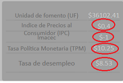
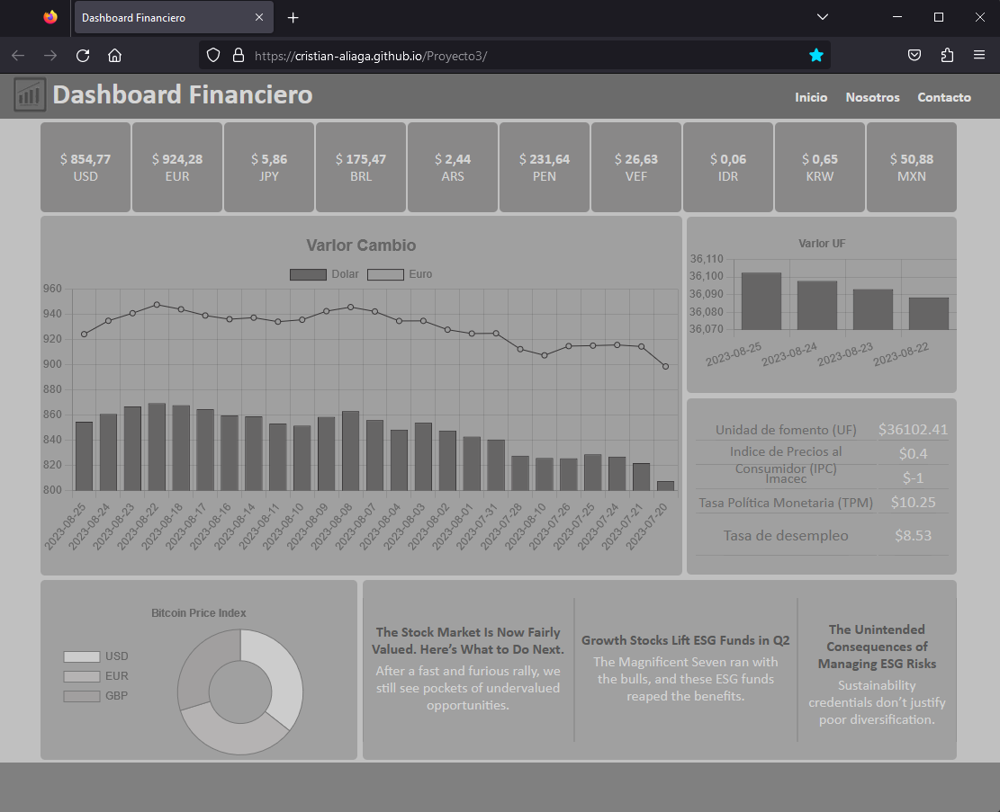
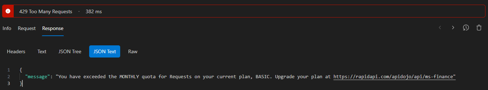

## Dashboard - Financiero
*Proyecto 3: Dashboard con **API públicas** y **ChartJS**.*
### URL Pública Dashboard:
<https://cristian-aliaga.github.io/Proyecto3/>
### API List utilizadas:
- api.gael.cloud
- ms-finance.p.rapidapi.com **[Requiere Key]**
- mindicador.cl
- api.coindesk.com

### Commits: 

1. 1er Commit: Layout HTML y CSS.
2. 2do Commit: Scripts JavaScript:
    - Articulos.
    - Gráfico principal.
    - Gráfico secundario.
    - Boxs precio monedas de cambio. 
    - Tabla de valores principales.
3. 3er Commit: Correccion ruta script.
4. 4to Commit: Por bloqueo de API, se elimina consulta recursiva (ForEach). 
5. 5to Commit: se agrega gráfico "Doughnut - Bitcoint Price". 
6. 6to Commit: se agrega documentasción archivo README.md. 
7. 7to Commit: se corrige el formato de la tabla de valores de $ a %, y modificaciones al achivo README.md.  

## Layout
*El Dashboard muestra en la parte superior con información de los indices bursatiles, en la parte central cuenta con un gráfico principal del historico mensual del comportamiento del valor del dolar y euro, también cuenta con un gráfico secundario con el valor de la UF y una tabla con indices. En la parte inferios se ve un gráfico con información del precio de Bitcoin y a la derecha se despliegan noticias bursatiles.*

>Nota:
>>Solo se mantuvo un Endpoint con Key por temas de bloqueo.

### Errores de API.
*Se realizaron algunas modificaciones y cambios de API debido a bloqueos por el límite de consultas diarias.*
*Por lo anterior se realizaron cambios en el código, eliminando los **ForEach** ya que generaban un gran consumo de las API.*

**Ejemplo de Error:**

